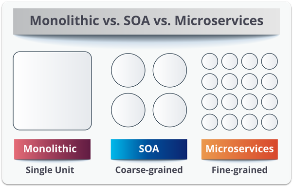

# Intro to RESTful APIs & Service Oriented Archtecture

## Objectives (5 min)

1. Define what an API and RESTful API is
1. Define our routes to respond to JSON requests

## Take Pre Final Quiz (20 min)

## Activity - Explore Service Oriented Architecture (10 min)

With a partner pick 2 companies on [stackshare.io](https://stackshare.io/stacks) and examine the services and languages they use. Google the services you are not familiar with.

## Overview

### RESTful APIs

So far we've been making User Interfaces (UI's) by returning HTML templates to the client, but what if we want to let other applications use our web server, such as a mobile app client, a desktop client, a front end framework, or another web server? In that case we want to make an API. We'd want to follow a **Service Oriented Architecture** or **SOA**.


An API is a set of web endpoints that respond to JSON (or XML) rather than with HTML templates. Basically, UI's are how people use your website, while API's are how other computers use your app.

We've already used APIs - like those found at [RapidAPI.com](rapidapi.com) - but now we want to make our own.

The structure of that API can be **Monolithic**, **Service Oriented**, or **Microservice Oriented**.

### Service Oriented Architectures (SOA)

A Service Oriented Architecture is the most common best practice for software architecture today. A SOA isolates and optimizes the various services your application needs. Using an SOA has many benefits:

* Less downtime
* Easier/faster testing
* Quicker bug detection
* Clearer team management
* Better optimized for scale
* And more!

You can think of an SOA like the old Buddhist story about the nature of truth about the 8 blind men and the elephant. Each part of the elephant is like a service that makes up the whole application.


Large companies build their own custom services for their various flows. However, even a small project like yours will use various off-the-shelf services and will therefore resemble SOA. For example:

1. Stripe or Braintree for handling payments
1. Google Analytics for analytics
1. Auth0 to handle authentication
1. AWS S3 for file storage
1. Firebase for chat rooms

### Microservices Architecture

A Microservices Architecture is SOA on steroids. It further breaks up services into sometimes even single routes and hyper specialized sorts of databases and technology.



## Implementation of a JSON RESTful API

To make our server a RESTful API, we need our server to respond intelligently to JSON requests. Since we already have RESTful routes that return HTML, we have two options, either we can make separate whole controllers, or we can check if the request coming in has the `Content-Type` header of `application/json`, and then behave accordingly.

Monolithic

```
controllers
  - posts.js
  - comments.js
```

Separate Controllers

```
controllers
  api
    - posts.js
    - comments.js
  - posts.js
  - comments.js
```

Versioned API 

```
controllers
  api
    v1
      - posts.js
      - comments.js
    v2
      - posts.js
      - comments.js
  - posts.js
  - comments.js
```


New API routes
```js
// INDEX
app.get('/api/posts', function(req, res){

});

// SHOW
app.get('/api/posts/:id', function(req, res){

});

// INDEX
app.get('/api/v1/posts', function(req, res){

});

// SHOW
app.get('/api/v1/posts/:id', function(req, res){

});

// ETC
```

Respond to application/json

```js
app.get('/posts', function(req, res){

  ...
  
  //=> RETURN JSON 
  if (req.header('Content-Type') == 'application/json') { return res.send({ post: post }); }

  //=> RETURN HTML
  return res.render('posts-show', { post: post }); //=> RENDER A TEMPLATE
});
```

> Notice that the NEW and EDIT routes are not necessary with a RESTful API.

## Activity: Video (10 min)

REST API concepts and examples

[](https://www.youtube.com/watch?v=7YcW25PHnAA)

Break into groups and decide what questions you still have about RESTful APIs.
